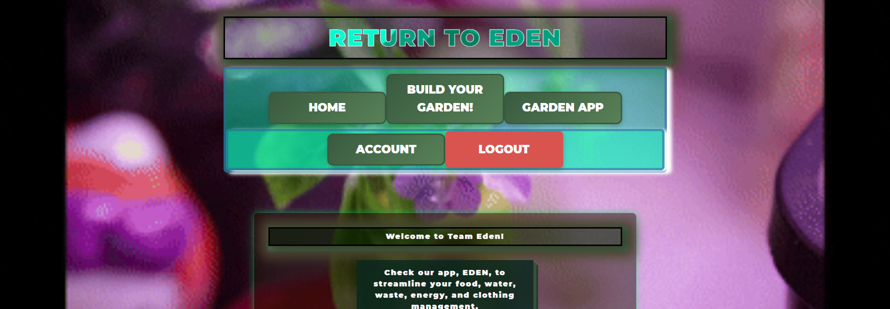

# CS 3010 ~ Spring 2025

## Eden App 

*A React/Vite + Node/PostgreSQL fullstack application*

- Register an account
- Update Account
- Login
- Logout
- Currently implementing blog/data management feature

## Getting Started

### Frontend 
* After cloning the repo...
Open terminal of working dir:

`cd frontend`
`npm install`
`npm run dev`

*Dependencies*
  - axios
  - bcryptjs
  - body-parser
  - bootstrap
  - cors
  - express
  - jsonwebtoken
  - lit
  - react
  - react-dom
  - react-router-dom

#### Backend
`cd backend`
`npm install`
`npm run start`

 *Dependencies:*
   - brycypt
   - cors
   - express
   - pg
   - winston

   
### DB setup

 * user_accounts
    - id 
    - username
    - password

  * user_account_details
    - id
    - user_id
    - firstname
    - lastname
    - email
    - profile_picture

  
